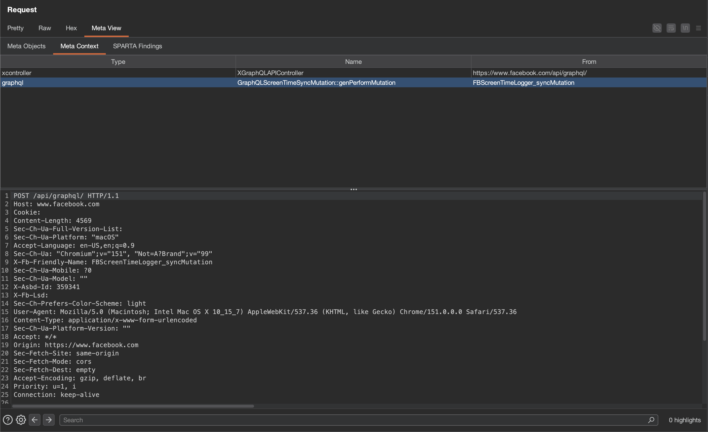

# Zurp

[](LICENSE)
[](CONTRIBUTING.md)
[](https://bugbounty.meta.com/)

Meta bug bounty research tools, in Burp Suite and in your coding agent.

Researching a Meta endpoint normally means a different tool, a different login and a different token for every question you have about it. Zurp is where those meet: it annotates the traffic already flowing through your proxy, and exposes the same capabilities to an AI agent over the same APIs and the same token.

Every Meta request and response gets a **Meta View** tab, showing what the identifiers in it actually name:



| Tool | What it answers | In Burp | For an agent |
|---|---|---|---|
| **Meta Context** | what *is* this id, URL, `doc_id` or operation? | **Meta View** tab on every Meta request | `meta-context` server |
| **SPARTA** | what has the scanner already found here? | **SPARTA** tab, PoCs queued into Organizer | `sparta` server |
| **FBDL** | where do I get accounts I am allowed to attack? | **FBDL** tab, `{{fbdl.*}}` placeholders | `fbdl` server |
| **CSRF / sprinkle** | why won't this captured request replay? | automatic on the request path | n/a |

Use one or use all four. Nothing here depends on anything else here, and each works only against your own account's data.

## Quick start

Download `zurp.jar` from the [latest release](https://github.com/facebookincubator/Zurp/releases/latest), then in Burp: **Extensions → Installed → Add → Extension type `Java` → `zurp.jar`**.

Open the **Zurp** tab, paste your [researcher token](#getting-access) into **Settings → Access Token**, and browse. That is the whole setup. Everything else has a working default.

Prefer to build it yourself? See [building from source](#building-from-source). For the agent side, see [installing the MCP servers](#the-mcp-servers).

## Getting access

Every tool here is gated on the **same allowlist as FBDL**. If you can use FBDL, your existing token works for all of this. If you cannot, every endpoint answers `403`. The criteria are at <https://www.facebook.com/whitehat/fbdl/>.

Mint a token at <https://www.facebook.com/whitehat/fbdl/generate_api_token>. Tokens last 60 days, and one drives everything: the extension and all three MCP servers.

> **Mint it while logged in as your enrolled researcher account.** A token carries whichever account your browser happens to be logged into, and nothing afterwards tells you which one that was. Mint from the wrong account and every call returns `403` complaining about enrollment, without naming the account it rejected. This is the most common setup problem by a wide margin.

## Requirements

* **Burp Suite** `2024.7` or newer. The extension parses JSON through `burp.api.montoya.utilities.json`, which landed in that release.
* **Java 17** to build from source. Burp supplies its own JVM to run the extension.
* **Node 22.19.0** or newer, for the MCP servers only.
* **An MCP client** for the agent side: Muse Code, MetaCode, Claude Code, or anything speaking MCP over stdio.

macOS and Linux are what the docs assume. The extension is a jar and the servers are Node, so Windows works too. Only the paths differ.

## Examples

**Replay a captured request without hunting for a token.** Paste into Repeater, swap the token for a placeholder, send:

```http
POST /api/graphql/ HTTP/2
Host: www.facebook.com
Content-Type: application/x-www-form-urlencoded

fb_dtsg={{fb_dtsg}}&jazoest=0&doc_id=9876543210987654&variables={}
```

Zurp substitutes the live token scraped from your own browsing, per host *and per logged-in account*, so victim and attacker tabs do not fight, and keeps the parameters that depend on it consistent, so the request replays instead of being rejected.

**Point a saved request at a test environment you built.** After `Pin FBDL run…` in the editor's context menu, labels from that run resolve on send:

```http
variables={"pageID":"{{fbdl.1234567890123456.PageOne}}","actorID":"{{fbdl.1234567890123456.UserTwo.uid}}"}
```

Re-run the script when the assets expire, re-pin, and the same saved request works against fresh ids.

**Ask your agent instead.** Hand a raw capture to Muse Code or Claude Code and let it pull the identifiers out:

```
Extracted 3 candidates (1 doc_id, 1 url, 1 fbid). 1 named something, 2 matched nothing.

doc_id=9876543210987654  [doc_id]
  graphql  CometGroupsMallQuery
```

Ten worked FBDL scripts, up to an IDOR boundary setup, are in [`bug-bounty-research/examples/`](bug-bounty-research/examples/).

## Building from source

The [release jar](https://github.com/facebookincubator/Zurp/releases/latest) is the easier path. Building it yourself needs a JDK 17 or newer and [Gradle](https://gradle.org/install/):

```bash
git clone https://github.com/facebookincubator/Zurp
cd Zurp
gradle jar          # -> build/libs/zurp.jar
gradle test         # optional; touches no network
```

The [Montoya API][montoya] jar is the only thing on the compile classpath, and deliberately is not bundled: Burp installs the implementation at load time, so a copy inside our jar would shadow Burp's and break the interfaces we implement. Zurp has no other dependencies.

To pick up a rebuild in a running Burp, untick and retick **Loaded** next to the extension.

The build pins Montoya to the oldest supported release rather than the newest, so the compiler enforces the version floor in [Requirements](#requirements) instead of a researcher discovering it as a missing method at runtime.

### The MCP servers, from source

```bash
cd bug-bounty-research
npm install
npm run build      # tsc -> dist/
npm test
```
## The MCP servers

[`bug-bounty-research/`](bug-bounty-research/README.md) is a standalone Node package sharing no code with the Java here, so it installs on its own if you do not run Burp. Each tool is a separate stdio server: `dist/meta-context/index.js`, `dist/sparta/index.js`, `dist/fbdl/index.js`.

Register the ones you want by absolute path. Full per-client instructions, including the several ways a Muse Code config fails *silently*, are in [`bug-bounty-research/README.md`](bug-bounty-research/README.md).

The agent skills in [`bug-bounty-research/skills/`](bug-bounty-research/skills/) teach an agent which tool to reach for and which errors are worth retrying.

## Documentation

* [docs/CONFIGURATION.md](docs/CONFIGURATION.md): every setting, environment and JVM seeding, log levels, and the `SSLProtocolException` fix.
* [docs/ARCHITECTURE.md](docs/ARCHITECTURE.md): how the pieces fit, the data model, your request budget, and known gaps.
* [bug-bounty-research/README.md](bug-bounty-research/README.md): the three servers, their tool surface, and per-client setup.
* [FBDL access criteria](https://www.facebook.com/whitehat/fbdl/): who can use these tools and how to qualify.
* [Montoya API documentation][montoya]: the extension API the Burp side is written against.
* [Meta Bug Bounty program terms](https://www.facebook.com/whitehat): what is in scope, and the rules all of this assumes you are working under.

## Contributing

Issues and pull requests are welcome. Development process, how to propose a fix, and how to test a change are in [CONTRIBUTING.md](CONTRIBUTING.md).

Found a security bug in Meta's products while using this? That goes through the [bounty program](https://bugbounty.meta.com/), not a GitHub issue.

### Code of Conduct

Meta has adopted a [Code of Conduct](CODE_OF_CONDUCT.md) we expect project participants to adhere to. Please read [the full text](https://opensource.fb.com/code-of-conduct/) so you understand what will and will not be tolerated.

## License

Zurp is [MIT licensed](LICENSE).

The FBDL server in `bug-bounty-research/` is ported from [fbdl-mcp](https://github.com/GangGreenTemperTatum/fbdl-mcp) by Ads Dawson, ISC licensed.

[montoya]: https://portswigger.github.io/burp-extensions-montoya-api/javadoc/burp/api/montoya/package-summary.html
