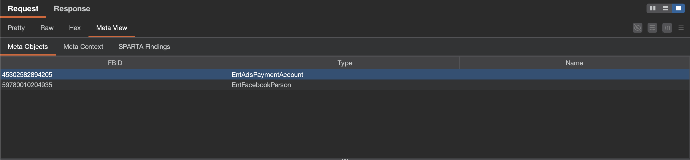

# Zurp features

What each tool does, in Burp and from an agent. For setup see the [README](../README.md); for how the pieces fit together, [ARCHITECTURE.md](ARCHITECTURE.md).

Every tool here works only against your own account's data, and each is independent. Use one or use all four.

## Meta Context: identifiers to the code behind them

Resolves an object id, an ad account, a URL, a persisted `doc_id`, a GraphQL operation name or a `com.bloks.*` id to the asset that serves it: an Ent or Node type, an XController, a Graph edge, a GraphQL resolver.

* **In Burp**, it runs on its own. Every Meta response you proxy is scanned for URLs, for 14 to 18 digit numbers, for ad accounts written `act_<digits>`, and for the `doc_id` and operation name of every GraphQL call. Candidates are resolved in the background on a 10s tick and rendered in the **Meta View** editor tab that Zurp adds to every Meta request and response.
* **For an agent**, `meta_context_scan` takes a whole report, HAR excerpt or log and extracts and resolves every candidate in one request; `meta_context_resolve_batch` takes up to 200 already isolated identifiers; `meta_context_resolve` takes one and is the only tool that returns a vanity name.
* An identifier that resolves to nothing is a normal answer, not an error. Most ids scraped out of live traffic name nothing at all. One identifier can also name several assets: a URL carrying an object id in its query string is both an XController and an Ent.

**Meta View** has three panes. **Meta Objects** lists the objects named in the request with their Ent or Node type; **Meta Context** is every kind the request resolved to, in one table; **SPARTA Findings** is covered below.

Two details worth knowing, because they explain results that otherwise look like bugs:

* **An ad account is written `act_<digits>`, and the digits are the id.** Zurp strips the prefix before asking, because the asset endpoint reads a prefixed number as something else entirely.
* **Not every number in a request is an id.** Two thirds of the candidates on a typical page load are microsecond clock readings, and a GraphQL `doc_id` looks exactly like an object id. Both are recognised and dropped before they are queued, so they cost neither a lookup nor a row.

This is a map from identifiers to **symbol names**. It is not code search: no file paths, no line numbers, no source, and nothing about who owns an asset.

## SPARTA: findings the scanner already raised

SPARTA is Meta's automated offensive-security scanner. Some of what it finds is disclosed to researchers on a private bounty as **leads**: a title, a summary, and a proof of concept with the identifiers taken out. A lead is not a confirmed vulnerability. Confirming one is your work, and the report is yours.

* **In Burp**, findings for the endpoint you are looking at appear in the **Meta View** tab and in the **SPARTA** tab. **Send PoCs to Organizer** (on by default) queues each newly disclosed PoC into Burp's **Organizer** as a ready-to-send request, once per finding, remembered in the project file, so you work them from your own queue. Only findings for endpoints you actually browsed are sent; the hourly catalog sweep stays out of your Organizer.
* **For an agent**, `sparta_scan_traffic` pulls the `doc_id` and `fb_api_req_friendly_name` out of a capture and reports every finding raised against them; `sparta_list_findings` gives the whole disclosed catalog worst-first; `sparta_get_finding` and `sparta_build_poc` take one finding to the GraphQL call it describes.
* **A disclosed PoC reproduces nothing as written.** Every value is a `{{TOKEN}}` placeholder, a boolean, or null, enforced where the finding is published, so a concrete identifier cannot be in there. Substitute from a test environment you built with FBDL, never an identifier belonging to a real account. In Burp, `fb_dtsg` is a placeholder too, filled in by the CSRF plane on send.

This is not a list of open vulnerabilities at Meta. It is the subset a scanner raised, that survived triage, that was chosen for disclosure, on a bounty you are enrolled in.

## FBDL: test environments you are allowed to attack

FBDL is a small declarative language for building a test environment: users, pages, groups, apps, ad accounts, and the relationships between them. A run creates them and hands back the ids and credentials.

* **In Burp**, the **FBDL** tab lists your runs and what each one created, swept periodically from the API, so a run you created in the FBDL web UI or from an agent shows up just the same. `Pin FBDL run…` in the Repeater and Intruder context menu writes a run id into the request, and `{{fbdl.<run id>.<label>}}` placeholders then resolve to that run's values on send.
* **For an agent**, the language tools cost no API budget at all. The grammar is fetched once and cached, so `validate_fbdl`, `list_entities`, `list_actions` and `explain_fbdl` are free. The run tools are `create_fbdl_run` (validated locally first, so a script that will not parse never reaches the API), `get_fbdl_run`, `list_fbdl_runs` and `archive_fbdl_run`.
* Placeholders name their run on purpose. Two runs of the same script produce the same labels with different values, so a placeholder that resolved on its own would silently repoint a saved request at another engagement's user, a request that succeeds against the wrong thing.

Assets are destroyed when a run is archived, so ids go stale routinely. Re-run the setup script, re-pin, and the same saved request works against the new environment. That loop is what the placeholders exist for.

## CSRF and sprinkle: making a captured request replay

Burp-only, and the one piece with no agent equivalent: it is a property of sitting on the proxy path. Zurp scrapes the CSRF tokens out of the responses you browse, keyed per host *and per logged-in account*, then on the way out substitutes `{{fb_dtsg}}`, `{{fb_dtsg_ag}}`, `{{lsd}}` and `{{csrf}}` and keeps the parameters that depend on them consistent. Enabled per tool; placeholders default on for Repeater and Intruder, auto-refresh defaults off everywhere.

Keying per account is what makes a two-actor test work: victim cookies in one tab and attacker cookies in another each get their own token, so neither overwrites the other.

Tokens are taken from traffic you are already generating rather than issued to you, so this adds no credential you did not already hold. They are held in memory only and never written to the Burp project file.

## Across the whole toolkit

* **One token, one budget.** The APIs allow each researcher 1000 requests an hour *per endpoint*, keyed on your account rather than on the app, so no other researcher can spend your budget, and you cannot spend theirs. Spending one endpoint's budget leaves the others untouched. Zurp holds itself to half of each endpoint's allowance, leaving the rest for what you fire by hand and for an agent on the same token.
* **Asset lookups are batched.** A tick resolves everything queued in as few calls as the batch endpoint allows, 200 identifiers a call on its own separate allowance, so a page load offering sixty candidates costs one call rather than sixty.
* **A rate limit pauses rather than retries.** If the server answers `429`, Zurp stops asking for five minutes and resumes on its own. Retrying through one would spend the very budget it is waiting for. Reloading the extension resets Zurp's counter but not the server's, so a reload is not a way out.
* **Every background lookup has a kill switch**, one checkbox per fetcher in the Burp tab, so a tool you are not using costs nothing.
* **Zurp is silent by default.** Its log level starts at `NONE`: Burp's extension output belongs to the researcher. Its own HTTP goes through Burp's stack, so it shows up in **Logger** under tool `Extensions` and obeys Burp's proxy and timeout settings.
* **Nothing is ever rethrown.** Zurp sits on the request path, so an unexpected request or response shape must never break your traffic.

For the full picture, including the package map, request and response paths, the persistence model and the constraints that forced it, and the current known gaps, see [ARCHITECTURE.md](ARCHITECTURE.md).
